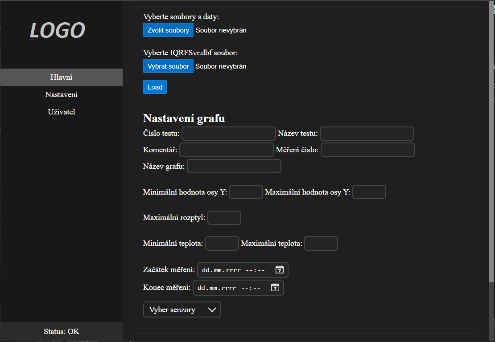

This project has not been fully uploaded!

1. Program decode encrypted .dbf file.
2. The program is capable of reading .dbf files even without a .dfb key file (if the file is not encrypted).
3. The program constructs a chart from millions of data points, offering various customization options.

Used stack:
Python (flask, pandas, tkinter, matplotlib)
Javascript
HTML
CSS
Electron/Node.js

